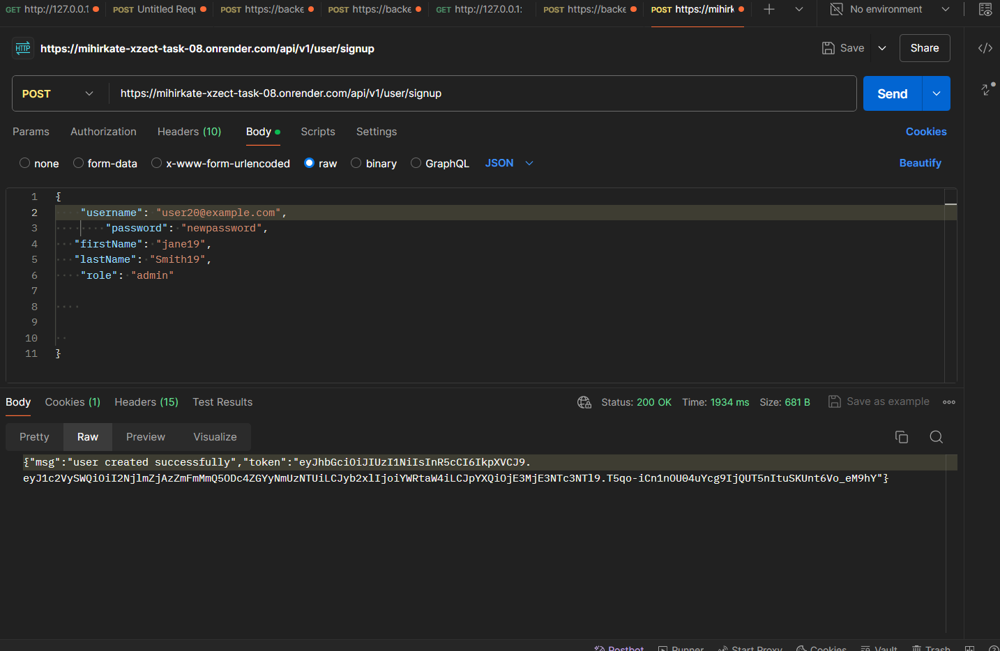
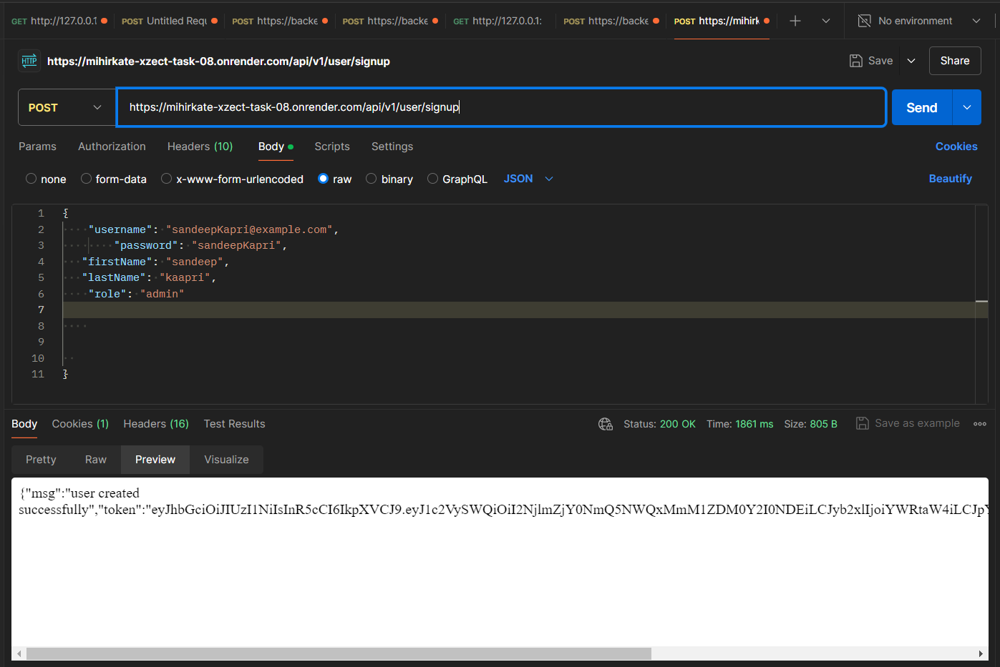
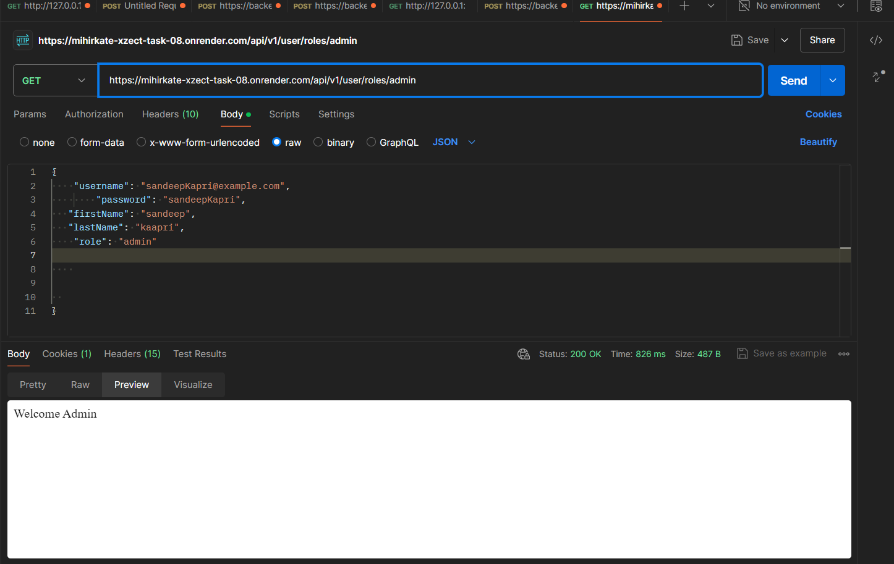

# 1.Build the Docker image:
    docker build -f Dockerfile -t task-8-dev .
 # 2.Run the Docker container:
docker run -p 3000:3000 --env-file .env task-8-dev
 
 # For Production:

# 1.Build the Docker image:

docker build -f Dockerfile.prod -t task-8-prod .
# 2.Run the Docker container:


docker run -p 3000:3000 --env-file .env task-8-prod

# Task 8

This project provides user authentication through JWT and OAuth using Google and GitHub providers. It also includes endpoints for managing user roles.

## OAuth Providers

- **Google OAuth**
  - Endpoint: [https://mihirkate-xzect-task-08.onrender.com/auth/google](https://mihirkate-xzect-task-08.onrender.com/auth/google)

- **GitHub OAuth**
  - Endpoint: [https://mihirkate-xzect-task-08.onrender.com/auth/github](https://mihirkate-xzect-task-08.onrender.com/auth/github)

## User Authentication

### Sign Up
- **Endpoint:** `POST /api/v1/user/signup`
- **Description:** Registers a new user.
  
  

### Sign In
- **Endpoint:** `POST /api/v1/user/signin`
- **Description:** Authenticates a user and returns a JWT.
  
  
  

### Update User
- **Endpoint:** `PUT /api/v1/user/`
- **Description:** Updates user details. Requires authentication.

### Bulk Retrieve Users
- **Endpoint:** `GET /api/v1/user/bulk`
- **Description:** Retrieves a list of users. Requires authentication.

  

## User Roles Endpoints

### Admin
- **Endpoint:** `GET /api/v1/user/roles/admin`
- **Description:** Retrieves users with the admin role.

### Guest
- **Endpoint:** `GET /api/v1/user/roles/guest`
- **Description:** Retrieves users with the guest role.

### Customer
- **Endpoint:** `GET /api/v1/user/roles/customer`
- **Description:** Retrieves users with the customer role.

### Reviewer
- **Endpoint:** `GET /api/v1/user/roles/reviewer`
- **Description:** Retrieves users with the reviewer role.

  

## Setup and Installation

1. Clone this repository:
    ```bash
    git clone <repository-url>
    cd task-8
    ```

2. Install dependencies:
    ```bash
    npm install
    ```

3. Create a `.env` file in the root directory and add your environment variables. Example:
    ```env
    PORT=3000
    MONGODB_URI=mongodb://localhost:27017/task-8
    JWT_SECRET=your_jwt_secret
    ```

4. Run the application:
    ```bash
    npm start
    ```

## Docker

To build and run the Docker container:

### Development

1. Build the Docker image:
    ```bash
    docker build -f Dockerfile -t task-8-dev .
    ```

2. Run the Docker container:
    ```bash
    docker run -p 3000:3000 --env-file .env task-8-dev
    ```

### Production

1. Build the Docker image:
    ```bash
    docker build -f Dockerfile.prod -t task-8-prod .
    ```

2. Run the Docker container:
    ```bash
    docker run -p 3000:3000 --env-file .env task-8-prod
    ```

## License

This project is licensed under the ISC License. See the [LICENSE](LICENSE) file for details.

**Author:** Mihir Kate
